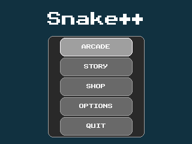
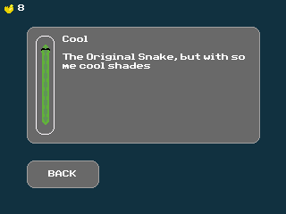
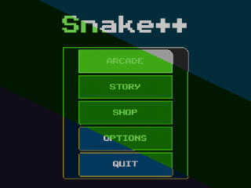

# Snake++

A snake game using C++ for the TI-84 Plus CE

## Game modes
### Classic
Collect food for points, making sure to not hit walls or yourself as you grow

> Other gamemodes will come in later releases

## Story

> Coming in a later release

## Store

Allows the player to buy and select snake skins using collected golden apples (from playing Snake++)

## Options
### UI
Allows for a fully-customizable themeing control with saving using an `AppVar`

### Stats

> Coming in a later release (for things like high-score, food eaten, etc.)
---
Using the [TI-84 Plus CE Calculator Toolchain](https://github.com/CE-Programming/toolchain)